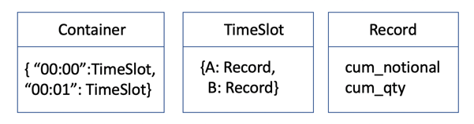
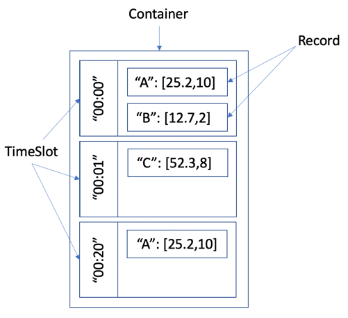
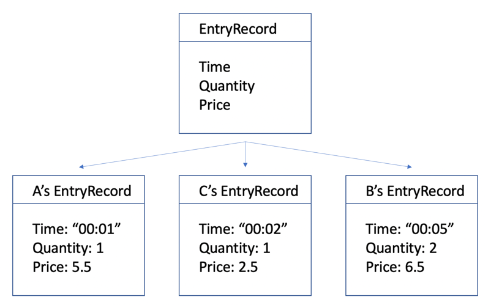
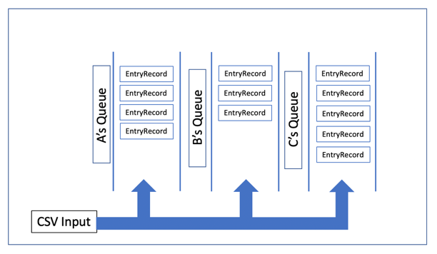
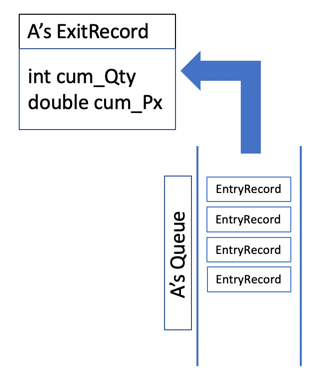

# CodeIT Suisse 2022 Entry Challenge Solution 

Input: CSV stream of ticks in the format: timestamp,ticker,quantity, price

Given Parameters: 
1. timestamp will just be hh:mm, can treat this as a string
2. price is any positive decimal greater than 0.0, we only need to handle 1d.p for the input and output

Assumptions: 
1. Input csv tickers is not sorted.
2. There is sufficient memory on the machine for the execution of our script
3. There might be duplicate entries. 

## Part One

Problem statement: Aggregate the stream by time in chronological order, with each out record in the format:
timestamp,ticker1,cumulative_quantity1,cumulative_notional1,ticker2,cumulative_quantity2,cumulative_notional2...

- Example: 00:00,A,5.5,B,4,4,4

Given:
1. notional is the product of quantity and price at each tick, and cumulaitve_notional is the running sum of notional values for each ticker up till the timestamp

Constraints: 
1. The group ticker, cumulative_quantity, cumulative_notional repeats for each ticker with a tick at that timestamp. 
2. Tickers should be sorted alphabetically

Expected output: 
1. done in a to_cumulative function(or equivalent) that takes in a list of string, and returns a list of string

Solution proposed: Maps of Maps of Arraylist

## Part Two

Problem statement: Aggregate the stream by time in chronological order, but this time each output record is "delayed" by only reporting cumulative quantities in blocks of quantity_block

Constraints: 
1. If only a portion of the current tick is applied for reporting the next quantity block, the notional calculation should factor the correct quantity, with the leftover quantity effectively hidden from the true cumulative_notional

Expected output: 
1. done in a to_cumulative_delayed function(or equivalent) that takes in a list of string and integer, and returns a list of string

Solution proposed: Maps of Queues
1. The CSV file is sorted according to the timestamp(ascending)
2. Each ticker will be added to its respective queue as an EntryRecord

3. Each queue will have a ExitRecord to store its cumulative information.For each of the queue, the first item will be removed and added into an ExitRecord until the required quantity is met.

4. The ExitRecord is added to the list(which will be returned),if quantity i is met.

